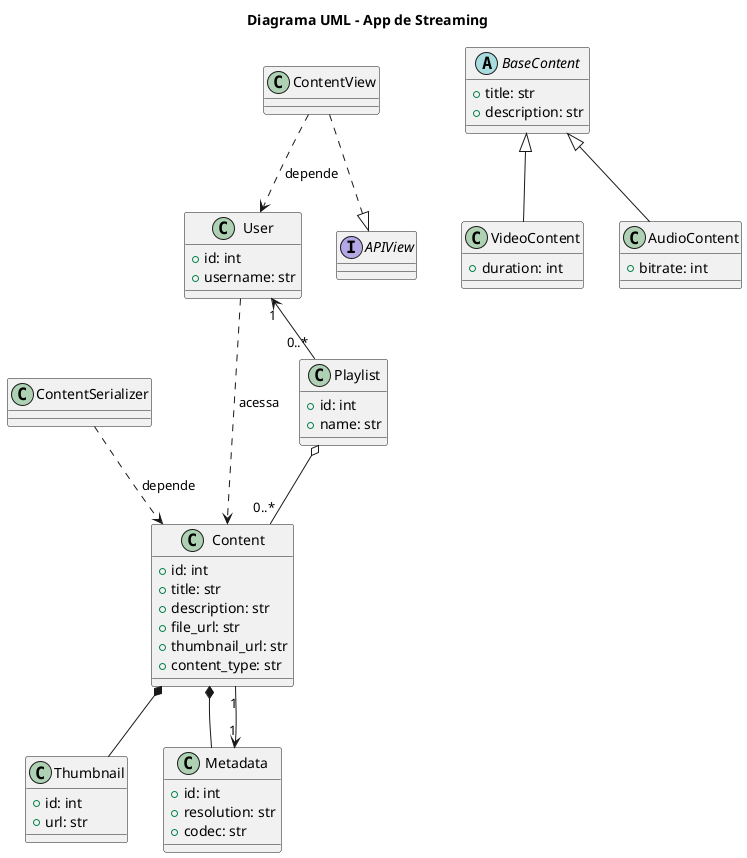

# 05 - Playlist -Relacionamento NxN

## Playlist

Para criar o modelo `Playlist` conforme a modelagem mencionada, ele deve ter relacionamentos com as classes `Content` e `User`. A `Playlist` representará uma coleção de conteúdos (áudios ou vídeos) que pertence a um usuário específico.

Abaixo está o código para definir o modelo `Playlist` no Django, assumindo que você já possui as classes `Content` e `User` configuradas.

### Modelo `Playlist`

```python
from django.db import models
from django.contrib.auth.models import User
from content_app.models import Content  # Assumindo que o modelo Content está no app 'content_app'

class Playlist(models.Model):
    title = models.CharField(max_length=255)  # Título da playlist
    description = models.TextField(blank=True, null=True)  # Descrição opcional da playlist
    user = models.ForeignKey(User, on_delete=models.CASCADE, related_name='playlists')  # Proprietário da playlist
    contents = models.ManyToManyField(Content, related_name='playlists')  # Conteúdos incluídos na playlist
    created_at = models.DateTimeField(auto_now_add=True)  # Data de criação
    updated_at = models.DateTimeField(auto_now=True)  # Data de última atualização

    class Meta:
        ordering = ['-created_at']
        verbose_name = 'Playlist'
        verbose_name_plural = 'Playlists'

    def __str__(self):
        return self.title
```

### Explicação dos Campos

1. **`title`**: Nome da playlist.

2. **`description`**: Descrição opcional, para explicar o propósito da playlist ou a seleção de conteúdos.
3. **`user`**: Chave estrangeira que faz referência ao modelo `User`, representando o dono da playlist.
4. **`contents`**: Relacionamento `ManyToMany` com `Content`, permitindo que vários conteúdos sejam adicionados à playlist.
5. **`created_at`** e **`updated_at`**: Campos de data para registrar a criação e a última atualização da playlist.

---

Para tornar o modelo `Playlist` acessível via API REST no Django, vamos definir o **serializador**, as **views** e as **URLs** usando o Django REST Framework. Dessa forma, será possível criar, listar, atualizar e deletar playlists, além de adicionar ou remover conteúdos de uma playlist.

### 1. **Definindo o Serializador**

O serializador converte as instâncias do modelo `Playlist` para JSON e valida os dados recebidos.

Crie um arquivo `serializers.py` dentro do seu app, se ele ainda não existir.

#### `serializers.py`

```python
from rest_framework import serializers
from .models import Playlist
from content.models import Content

class ContentSerializer(serializers.ModelSerializer):
    class Meta:
        model = Content
        fields = ['id', 'title', 'file_url', 'thumbnail_url', 'content_type']

class PlaylistSerializer(serializers.ModelSerializer):
    contents = ContentSerializer(many=True, read_only=True)
    content_ids = serializers.PrimaryKeyRelatedField(
        queryset=Content.objects.all(), write_only=True, many=True, source='contents'
    )

    class Meta:
        model = Playlist
        fields = ['id', 'title', 'description', 'user', 'contents', 'content_ids', 'created_at']
        read_only_fields = ['user', 'created_at']

    def create(self, validated_data):
        content_data = validated_data.pop('contents', [])
        playlist = super().create(validated_data)
        playlist.contents.set(content_data)
        return playlist

    def update(self, instance, validated_data):
        content_data = validated_data.pop('contents', None)
        playlist = super().update(instance, validated_data)
        if content_data is not None:
            playlist.contents.set(content_data)
        return playlist
```

* **`contents`**: Serializa os conteúdos da playlist de forma detalhada.
* **`content_ids`**: Permite adicionar conteúdos à playlist usando IDs.
* **`user`**: É preenchido automaticamente na view com o usuário autenticado.

### 2. **Definindo as Views**

Vamos usar o **Django REST Framework ViewSets** para definir as operações de CRUD na `Playlist`.

Crie ou edite o arquivo `views.py` no seu app.

#### `views.py`

```python
from rest_framework import viewsets, permissions
from .models import Playlist
from .serializers import PlaylistSerializer

class PlaylistViewSet(viewsets.ModelViewSet):
    queryset = Playlist.objects.all()
    serializer_class = PlaylistSerializer

    def perform_create(self, serializer):
        serializer.save(user=self.request.user)

    def get_queryset(self):
        # Permite que o usuário veja apenas suas próprias playlists
        return self.queryset.filter(user=self.request.user)
```

* **`perform_create`**: Define o usuário autenticado como proprietário da playlist.
* **`get_queryset`**: Filtra as playlists para mostrar apenas as pertencentes ao usuário autenticado.

### 3. **Definindo as URLs**

Crie ou edite o arquivo `urls.py` no seu app e configure as URLs para o endpoint `Playlist`.

#### `urls.py`

```python
#content_app/urls.py
from django.urls import path, include
from rest_framework.routers import DefaultRouter
from .views import PlaylistViewSet

router = DefaultRouter()
router.register(r'playlists', PlaylistViewSet, basename='playlist')

urlpatterns = [
    path('', include(router.urls)),
]
```

### 4. **Testando a API**

Com o Django REST Framework, você pode acessar e interagir com a API nos seguintes endpoints:

* `GET /api/playlists/` - Listar todas as playlists do usuário autenticado.
* `POST /api/playlists/` - Criar uma nova playlist (enviar `title`, `description` e `content_ids`).
* `GET /api/playlists/<id>/` - Obter detalhes de uma playlist específica.
* `PUT /api/playlists/<id>/` - Atualizar uma playlist existente (enviar `title`, `description`, e `content_ids`).
* `DELETE /api/playlists/<id>/` - Excluir uma playlist específica.

# 11 - Relacionamentos

<<<<<<<< HEAD:docs/Disciplina/Roteiros/Construcao/Streaming/05_Playlist_NxN.md

========
Aplicando os conceitos da **Programação Orientada a Objetos (POO)** ao contexto do **App de Streaming de Áudio e Vídeo com Django REST**.

Abaixo, temos cada conceito com uma explicação e exemplos baseados nas classes já envolvidas, como `User`, `Content`, `Playlist`, etc.

---

## ✅ 1. **Associação**

> **Objetos se comunicam temporariamente.**

### 🔸 Exemplo:

Na view de listagem, a `ContentView` pode acessar dados do usuário apenas enquanto executa a requisição.

```python
class ContentView(APIView):
    def get(self, request):
        user = request.user  # Associação temporária com o objeto User
        contents = Content.objects.filter(owner=user)
        ...
```
>>>>>>>> d8f7e94c7a3ebdc7261617e9db5ef937ac6cbada:docs/Disciplina/Roteiros/Construcao/Streaming/05_Playlist.md

---

## ✅ 2. **Agregação**

> **Relação "tem-um"** onde a parte pode existir sem o todo.

### 🔸 Exemplo:

Um `Playlist` **tem muitos `Content`**, mas os `Content` podem existir fora da `Playlist`.

```python
class Playlist(models.Model):
    user = models.ForeignKey(User, on_delete=models.CASCADE)
    name = models.CharField(max_length=100)
    contents = models.ManyToManyField(Content)
```

Aqui, `Content` existe independentemente da `Playlist`.

---

## ✅ 3. **Composição**

> **Relação "parte-de"**, onde a parte **não existe sem o todo**.

### 🔸 Exemplo:

Se criássemos um modelo `Thumbnail` separado, mas exclusivo para um único `Content`:

```python
class Content(models.Model):
    ...
    # Cada content tem um thumbnail que é excluído junto com ele
    thumbnail = models.OneToOneField("Thumbnail", on_delete=models.CASCADE)

class Thumbnail(models.Model):
    url = models.URLField()
```

O `Thumbnail` não existiria fora do `Content`.

---

## ✅ 4. **Herança**

> **"É-um"**: Uma subclasse herda de uma superclasse.

### 🔸 Exemplo:

Se tivermos tipos específicos de conteúdo:

```python
class BaseContent(models.Model):
    title = models.CharField(max_length=255)
    description = models.TextField()

class VideoContent(BaseContent):
    duration = models.IntegerField()

class AudioContent(BaseContent):
    bitrate = models.IntegerField()
```

`VideoContent` **é um** `BaseContent`.

---

## ✅ 5. **Dependência**

> Uma classe **usa** outra temporariamente.

### 🔸 Exemplo:

Um serializer que depende temporariamente de outro modelo:

```python
class PlaylistSerializer(serializers.ModelSerializer):
    class Meta:
        model = Playlist
        fields = ['name', 'contents']
```

Aqui, o serializer depende temporariamente da estrutura do `Playlist`.

---

## ✅ 6. **Realização**

> Implementação de uma **interface (abstração)**.

### 🔸 Exemplo:

Django não usa interfaces formais como Java/C#, mas usamos **abstrações como `APIView`**:

```python
class ContentListView(APIView):
    def get(self, request):
        ...
```

A `ContentListView` **realiza** (implementa) a interface da `APIView`.

---

## ✅ 7. **Associação Bidirecional**

> Duas classes se referenciam mutuamente.

### 🔸 Exemplo:

Um `User` tem `Playlists` e a `Playlist` tem um `User`.

```python
# Playlist aponta para User
class Playlist(models.Model):
    user = models.ForeignKey(User, on_delete=models.CASCADE)

# No código, você pode acessar bidirecionalmente:
playlist.user  # da playlist para user
user.playlist_set.all()  # do user para as playlists
```

---

## ✅ 8. **Cardinalidade (1:1)**

> Uma instância de um modelo se relaciona com exatamente uma instância de outro.

### 🔸 Exemplo:

Relacionamento entre `Content` e `Metadata`:

```python
class Content(models.Model):
    title = models.CharField(max_length=255)
    metadata = models.OneToOneField('Metadata', on_delete=models.CASCADE)

class Metadata(models.Model):
    resolution = models.CharField(max_length=50)
    codec = models.CharField(max_length=50)
```

Cada `Content` tem **um único `Metadata`**, e vice-versa.

---

### Diagrama de Classes

Abaixo temos o **diagrama UML em PlantUML** representando os conceitos de POO aplicados ao seu app de **streaming de áudio e vídeo** com base nos modelos discutidos:

---

### 📌 **PlantUML**


