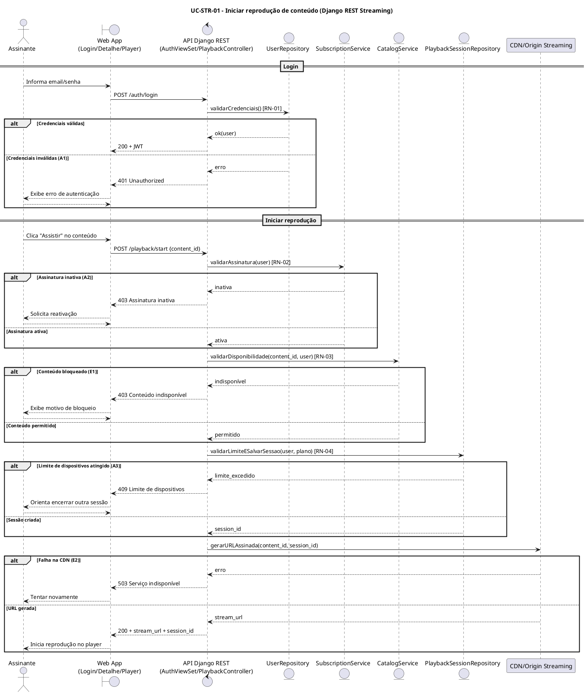

### Diagrama de Sequência

O Diagrama de Sequência é uma representação visual que mostra a interação entre objetos ou componentes ao longo do tempo. Ele é usado para modelar o comportamento dinâmico de um sistema, ilustrando como os objetos colaboram para realizar uma funcionalidade específica.	

#### Objetivo

Definir um padrão para elaboração e registro dos Diagramas de Sequência, garantindo rastreabilidade com:

- Casos de Uso
- Diagrama de Casos de Uso
- Documento de Levantamento de Requisitos
- Protótipo de Baixa Fidelidade

#### Instruções de Preenchimento

1. Selecione um Caso de Uso prioritário.
2. Identifique os requisitos funcionais e regras de negócio relacionados.
3. Mapeie as telas/fluxos no protótipo de baixa fidelidade.
4. Modele a interação entre ator(es), fronteira, controle e entidade.
5. Valide consistência com o fluxo principal e fluxos alternativos.


#### Template — Diagrama de Sequência por Caso de Uso

##### 1. Identificação

- **Caso de Uso:**  
- **ID do Caso de Uso:**  
- **Ator(es):**  
- **Prioridade:**  
- **Responsável:**  
- **Data:**  

##### 2. Referências

- **Requisitos relacionados (ID):**  
- **Diagrama de Caso de Uso (link/imagem):**  
- **Protótipo de Baixa Fidelidade (tela/fluxo):**  
- **Regra(s) de negócio associada(s):**  

##### 3. Cenário Modelado

- **Objetivo do cenário:**  
- **Pré-condições:**  
- **Pós-condições:**  
- **Gatilho de início:**  

##### 4. Participantes (Lifelines)

- **Ator:**  
- **Boundary (Interface/Tela):** componente responsável pela interação com o ator (entrada e saída de dados), representando telas, formulários ou APIs de interface.  
- **Control (Orquestração):** componente responsável pela coordenação e lógica de negócio, orquestrando a comunicação entre a interface (Boundary), dados (Entity) e sistemas externos, aplicando regras de negócio e validações.
- **Entity (Dados/Serviços):** componente responsável por representar e manipular dados persistentes e serviços de domínio, encapsulando operações de acesso, consulta e atualização de informações utilizadas pelo Control.  
- **Sistemas externos (se houver):** componentes ou serviços fora do limite da aplicação (ex.: APIs de terceiros, gateways, sistemas legados) que interagem com o Control para troca de dados, execução de operações ou integração de processos.  

##### 5. Fluxo Principal (mensagens)

| Passo | Remetente | Destinatário | Mensagem/Ação | Tipo (sync/async/retorno) |
|------:|-----------|--------------|---------------|----------------------------|
| 1 |  |  |  |  |
| 2 |  |  |  |  |
| 3 |  |  |  |  |

##### 6. Fluxos Alternativos e Exceções

| ID | Condição | Descrição do fluxo | Impacto |
|----|----------|--------------------|---------|
| A1 |  |  |  |
| E1 |  |  |  |

##### 7. Regras de Negócio Aplicadas

- **RN-xx:**  
- **RN-yy:**  

##### 8. Pontos de Validação

- [ ] Fluxo compatível com Caso de Uso  
- [ ] Mensagens consistentes com requisitos funcionais  
- [ ] Alternativas/exceções representadas  
- [ ] Participantes aderentes à arquitetura  
- [ ] Correspondência com protótipo de baixa fidelidade  

##### 9. Artefatos

- **Imagem do Diagrama de Sequência:**  
- **Arquivo fonte (PlantUML):**  
- **Versão:**  

---


#### Exemplo de estrutura textual mínima (opcional)

```text
Ator inicia ação na Tela X
Tela X envia solicitação para Controlador Y
Controlador Y valida regra RN-01
Controlador Y consulta Entidade/Serviço Z
Entidade/Serviço Z retorna resultado
Controlador Y responde à Tela X
Tela X apresenta confirmação ao Ator

### Diagrama de Sequência em PlantUML

```
@startuml
title Exemplo de Diagrama de Sequência (estrutura mínima)

actor "Ator" as Ator
boundary "Tela X" as TelaX
control "Controlador Y" as CtrlY
entity "Entidade/Serviço Z" as EntZ

Ator -> TelaX : Inicia ação
activate TelaX

TelaX -> CtrlY : Envia solicitação
activate CtrlY

note right of CtrlY
Valida regra RN-01
end note

CtrlY -> EntZ : Consulta dados/serviço
activate EntZ
EntZ --> CtrlY : Retorna resultado
deactivate EntZ

CtrlY --> TelaX : Resposta da operação
deactivate CtrlY

TelaX --> Ator : Apresenta confirmação
deactivate TelaX

@enduml

<!-- ...existing code... -->

#### Exemplo aplicado — UC-STR-01: Iniciar reprodução de conteúdo

##### 1. Identificação

- **Caso de Uso:** Iniciar reprodução de conteúdo  
- **ID do Caso de Uso:** UC-STR-01  
- **Ator(es):** Assinante  
- **Prioridade:** Alta  
- **Responsável:** Equipe Backend/Frontend  
- **Data:** 28/05/2026  

##### 2. Referências

- **Requisitos relacionados (ID):** RF-LOGIN-01, RF-PLAY-02, RF-ASSINATURA-03  
- **Protótipo de Baixa Fidelidade (tela/fluxo):** Tela Login -> Tela Detalhe do Conteúdo -> Player  
- **Regra(s) de negócio associada(s):** RN-01, RN-02, RN-03, RN-04  

##### 3. Cenário Modelado

- **Objetivo do cenário:** Permitir que o assinante reproduza um conteúdo selecionado.  
- **Pré-condições:** Usuário cadastrado; conteúdo existente no catálogo.  
- **Pós-condições:** Sessão de reprodução iniciada com URL de stream válida.  
- **Gatilho de início:** Assinante clica em **Assistir** no detalhe do conteúdo.  

##### 4. Participantes (Lifelines)

- **Ator:** Assinante  
- **Boundary:** Web App (Tela Login/Detalhe/Player)  
- **Control:** API Django REST (AuthViewSet / PlaybackController)  
- **Entity:** UserRepository, SubscriptionService, CatalogService, PlaybackSessionRepository  
- **Sistema externo:** CDN/Origin Streaming  

##### 5. Fluxo Principal (mensagens)

| Passo | Remetente | Destinatário | Mensagem/Ação | Tipo |
|------:|-----------|--------------|---------------|------|
| 1 | Assinante | Web App | Informar credenciais e entrar | sync |
| 2 | Web App | API Django REST | POST /auth/login | sync |
| 3 | API Django REST | UserRepository | Validar credenciais (RN-01) | sync |
| 4 | API Django REST | Web App | Retorna JWT | retorno |
| 5 | Assinante | Web App | Selecionar conteúdo e clicar Assistir | sync |
| 6 | Web App | API Django REST | POST /playback/start {content_id} | sync |
| 7 | API Django REST | SubscriptionService | Validar assinatura ativa (RN-02) | sync |
| 8 | API Django REST | CatalogService | Validar disponibilidade/classificação (RN-03) | sync |
| 9 | API Django REST | PlaybackSessionRepository | Validar limite de dispositivos (RN-04) e criar sessão | sync |
|10 | API Django REST | CDN/Origin Streaming | Solicitar URL assinada | sync |
|11 | CDN/Origin Streaming | API Django REST | Retorna stream_url | retorno |
|12 | API Django REST | Web App | 200 OK + stream_url + session_id | retorno |
|13 | Web App | Assinante | Inicia reprodução no Player | retorno |

##### 6. Fluxos Alternativos e Exceções

| ID | Condição | Descrição do fluxo | Impacto |
|----|----------|--------------------|---------|
| A1 | Credenciais inválidas | API retorna 401 no login | Usuário permanece na tela de login |
| A2 | Assinatura inativa | API retorna 402/403 com motivo | Exibir CTA para reativar assinatura |
| A3 | Limite de dispositivos atingido | API retorna 409 | Usuário deve encerrar outra sessão |
| E1 | Conteúdo indisponível por região/idade | API retorna 403 | Bloqueia reprodução e informa motivo |
| E2 | Falha na CDN | API retorna 503 | Tentar novamente mais tarde |

##### 7. Regras de Negócio Aplicadas

- **RN-01:** Apenas credenciais válidas geram JWT.  
- **RN-02:** Somente assinantes com plano ativo podem reproduzir.  
- **RN-03:** Conteúdo deve respeitar disponibilidade regional e classificação etária.  
- **RN-04:** Limite de sessões simultâneas por plano deve ser respeitado.  

### Diagrama de Sequência em PlantUML (UC-STR-01)



<!-- ...existing code... -->
